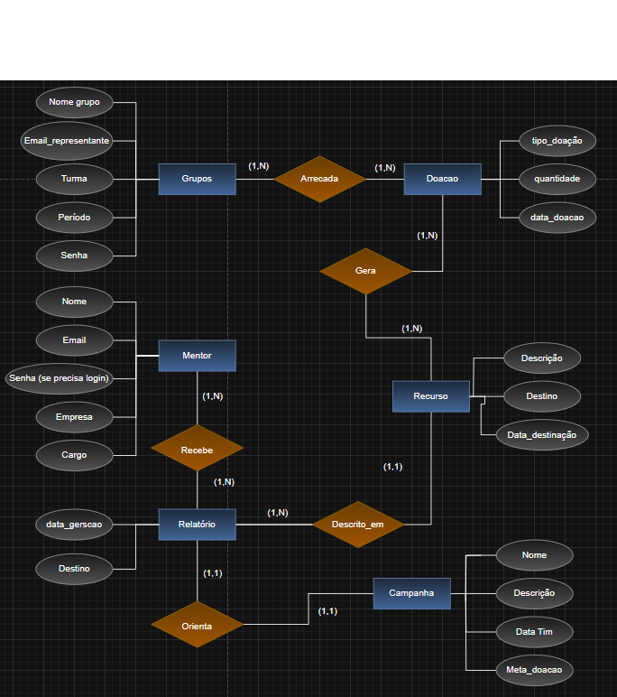

# 🗄️ Banco de Dados - Entrega 1
 **Professora:** Katia Bossi
 ---
## 📖 Descrição do Trabalho
Esta entrega consiste na **modelagem do banco de dados** para o projeto interdisciplinar.  
O objetivo é criar um diagrama que represente todas as tabelas, relações, chaves primárias e estrangeiras, garantindo que a estrutura suporte corretamente o sistema.

O diagrama abaixo apresenta todas as entidades relevantes e seus relacionamentos.
---
## 📖 Introdução
O projeto foi desenvolvido com o objetivo de criar uma plataforma que facilite a interação entre alunos e mentores, oferecendo um ambiente simples e acessível para estudos e acompanhamento.  
Na fase inicial, foi elaborado um **diagrama entidade-relacionamento**, representando as principais entidades (**Aluno, Mentor e Grupo**) e como elas se relacionam. Esse diagrama serviu como guia para a construção do sistema.
---
## 🗂 Diagrama do Banco de Dados

> Este diagrama representa todas as entidades, suas tabelas, relações e chaves primárias e estrangeiras necessárias para o funcionamento adequado do sistema.
---
## 📖 Conclusão
O projeto foi finalizado com sucesso, atendendo ao objetivo de criar um espaço de comunicação entre aluno e mentor.  
O mapa final do sistema representa de forma clara a jornada: do planejamento com o diagrama, passando pela construção das páginas, até a integração e publicação.  
Para encerrar, foi produzido um vídeo demonstrativo, exibindo na prática o funcionamento do site e suas principais funcionalidades.
---
## 📑 Observações
- Todas as tabelas e relacionamentos foram modelados para refletir as necessidades do sistema.  
- Caso necessário, cada tabela possui chaves primárias e estrangeiras definidas para manter a integridade do banco.  
> ⚠️ A entrega desta disciplina está localizada na pasta **Banco De Dados**.